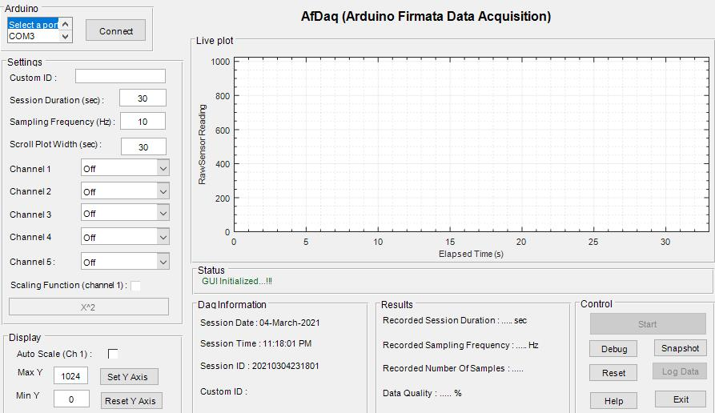

<!-- PROJECT LOGO -->
<br />
<p align="center">
  <a href="https://github.com/kulbhushanchand/AfDaq">
    
  </a>
  <h2 align="center">Arduino Firmata Data Acquisition (AfDaq)</h2>
  <p align="center">
    A plug and play MATLAB based tool for biofeedback and Arduino based instruments    
  <br />
    <a href="https://kulbhushanchand.github.io/AfDaq/"><strong>Explore the docs »</strong></a>
    <br />
  </p>
</p>

---
<br />

## Table of Contents

- [About the Project](#about-the-project)
  - [Built with](#built-with)
  - [Features](#features)
  - [Why another acquisition program?](#why-another-acquisition-program)
- [Getting started](#getting-started)
  - [Prerequisites](#prerequisites)
  - [Installation and Running](#installation-and-running)
- [Usage](#usage)
  - [Examples](#examples)
- [Roadmap](#roadmap)
- [Contributing](#contributing)
- [License](#license)
- [Contact](#contact)
- [Acknowledgment](#acknowledgment)
- [Citation](#citation)

## About the project


**AfDaq** (Arduino Firmata Data Acquisition) is an open-source plug-and-play MATLAB-based tool for biofeedback and Arduino-based instruments, which offers the capabilities of multi-channel real-time data acquisition, visualization, manipulation, and local saving of data for offline analysis.  
The researchers (especially from biofeedback or physiological measurement domain) or hobbyist, who are using MATLAB and want to acquire data from Arduino or to control Arduino-based instruments can use this tool.

### Built with

This GUI tool is built using the `Guide` tool in [MATLAB-v2017b](https://in.mathworks.com/products/matlab.html). For the hardware, any [Arduino](https://www.arduino.cc/) compatible board can be used which is [supported by MATLAB](https://in.mathworks.com/hardware-support/arduino-matlab.html#localnav:~:text=Supported%20Hardware).

### Features

- Plug and play system (no need to separately upload any code on Arduino board).
- Real-time multi-channel data acquisition from supported digital or analog channels.
- Sampling rate of - 
  - 10 Hz when using all 5 channels simultaneously
  - 40 Hz when using single-channel acquisition.
- Real-time data visualization (in scroll plot) and data manipulation (with custom functions).
- Local saving of data in `.xlsx` format for offline analysis.
- Screenshot of current GUI for reference purpose.

### Why another acquisition program?

Researchers in the biofeedback domain or working on Arduino-based instruments often require a quick-to-deploy system to acquire real-time data from Arduino and for further analysis transfer the data in MATLAB. For this, MATLAB has provided [MATLAB Support Package for Arduino Hardware](https://in.mathworks.com/help/supportpkg/arduinoio/) which eases the data acquisition need from Arduino compatible hardware by automatically updating firmata code on Arduino board and providing functions for data acquisition. However, at present, its use in physiological research is limited due to severe timing jitter associated with data acquisition. 

This software tool aims to reduce the timing jitter and provides precise time stamps during data acquisition.


<!-- GETTING STARTED -->
## Getting started

Working with AfDaq is a straightforward process. Make sure you have prerequisites available and follow the steps below.

### Prerequisites

- [MATLAB](https://in.mathworks.com/products/matlab.html) 
>`MATLAB-ver2017b` was used to develop the AfDaq. It was also tested with `ver2015b` and `ver2018b` for backward and forward compatibility respectively. It may not work with `ver20xx and before` due to the unavailability of compatible `MATLAB Support Package for Arduino Hardware`. 
- [MATLAB Support Package for Arduino Hardware](https://in.mathworks.com/hardware-support/arduino-matlab.html)
- [Arduino](https://www.arduino.cc/) compatible hardware board. 
>For the list of the supported boards, visit documentation [here](https://in.mathworks.com/hardware-support/arduino-matlab.html#localnav:~:text=Supported%20Hardware).

### Installation and running

1. Download the [latest stable release](https://github.com/kulbhushanchand/AfDaq/releases) and extract contents into your MATLAB working directory. Alternatively, you can also download the latest code from the [repository](https://github.com/kulbhushanchand/AfDaq).
2. Open `AfDaq.m` in MATLAB.
3. Connect Arduino board to PC with USB cable. If the board is pre-configured with Firmata code by MATLAB, a message is shown in the command window.
4. Run `AfDaq.m` and wait for the GUI to appear.
5. In the GUI select the `COM` port for the Arduino and press the `Connect` button. If the Arduino is not pre-configured with Firmata code by MATLAB, it may take few minutes (It's a one-time process in the beginning OR if the board is re-flashed outside).
6. After a successful connection, appropriate settings can be selected and acquisition is manually started.
7. The acquisition runs till a set time or can be stopped manually.
8. After successful completion, the information panel shows various statistics related to the acquisition.
9. Data can be saved for offline processing.


<!-- USAGE EXAMPLES -->
## Usage

Use this space to show useful examples of how a project can be used. Additional screenshots, code examples, and demos work well in this space. You may also link to more resources.  
*For more examples, please refer to the [Documentation](https://kulbhushanchand.github.io/AfDaq/)*.


### Examples

To be added.


<!-- ROADMAP -->
## Roadmap

See the [open issues](https://github.com/kulbhushanchand/AfDaq/issues) for a list of proposed features (and known issues).


<!-- CONTRIBUTING -->
## Contributing

Any contributions you make are greatly appreciated. You can contribute to this project in the following ways :

- Add new functionality
- Review code
- Raise issues about bugs/features/doubts
- Proof-read the documentation
- Cite if used in a publication
- Star on GitHub
- Share with others

Please note that this project is released with a [Contributor Code of Conduct](https://github.com/kulbhushanchand/AfDaq/blob/master/CODE_OF_CONDUCT.md). By contributing to this project you agree to abide by its terms.


<!-- LICENSE -->
## License

This project is distributed under the `GPLv3` License. See [LICENSE](https://github.com/kulbhushanchand/AfDaq/blob/master/LICENSE) for more information.


## Citation

This software code is a part of the open-source project [**AfDaq: An Open-source MATLAB-based Real-time Multi-channel Data Acquisition Tool for Biofeedback and Arduino-based Instruments**](https://doi.org/10.17605/OSF.IO/VCTJM). The paper explaining the design and development, and usage of this work in multimodal biofeedback is published in [**Journal of Information Technology Research (JITR)**](). You can cite this work (by citing the paper published for this work) as -

```
In press
```


<!-- ACKNOWLEDGMENTS -->
## Acknowledgment

I would like to thank my PhD supervisor [Prof. Arun Khosla](https://www.nitj.ac.in/index.php/nitj_cinfo/Faculty/38) at Dr B R Ambedkar National Institute of Technology for his guidance and kind support. I also want to acknowledge the open-source tools used in some parts of this project.

- [RStudio](https://www.rstudio.com/) is used for statistical analysis and visualizations.
- [drawio-desktop](https://github.com/jgraph/drawio-desktop) is used to create logo and diagrams.


<!-- CONTACT -->
## Contact

[Kulbhushan Chand](https://kulbhushanchand.github.io/about/)