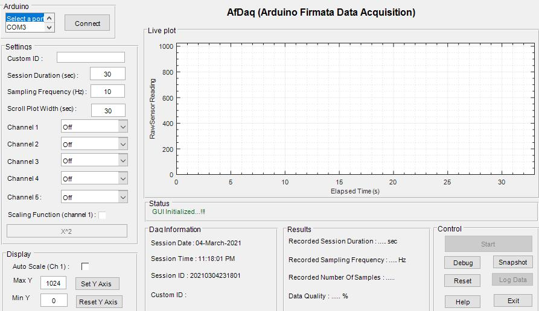

# Introduction {#intro}

---

## About the project {#about}

```{r fig.cap= 'GUI of AfDaq', echo=FALSE, fig.align='center', out.width='75%'}

```

AfDaq (Arduino Firmata Data Acquisition) is an open-source plug-and-play MATLAB-based tool for biofeedback and Arduino-based instruments, which offers the capabilities of multi-channel real-time data acquisition, visualization, manipulation, and local saving of data for offline analysis.  
The researchers (especially from biofeedback or physiological measurement domain) or hobbyist, who are using MATLAB and want to acquire data from Arduino or to control Arduino-based instruments can use this tool.


## Built with

This GUI tool is built using the `Guide` tool in [MATLAB-v2017b](https://in.mathworks.com/products/matlab.html). For the hardware, any [Arduino](https://www.arduino.cc/) compatible board can be used which is [supported by MATLAB](https://in.mathworks.com/hardware-support/arduino-matlab.html#localnav:~:text=Supported%20Hardware).


## Features

- Plug and play system (no need to separately upload any code on Arduino board).
- Real-time multi-channel data acquisition from supported digital or analog channels.
- Sampling rate of - 
  - 10 Hz when using all 5 channels simultaneously
  - 40 Hz when using single-channel acquisition.
- Real-time data visualization (in scroll plot) and data manipulation (with custom functions).
- Local saving of data in `.xlsx` format for offline analysis.
- Screenshot of current GUI for reference purpose.


## Why another acquisition program?

Researchers in the biofeedback domain or working on Arduino-based instruments often require a quick-to-deploy system to acquire real-time data from Arduino and for further analysis transfer the data in MATLAB. For this, MATLAB has provided [MATLAB Support Package for Arduino Hardware](https://in.mathworks.com/help/supportpkg/arduinoio/) which eases the data acquisition need from Arduino compatible hardware by automatically updating firmata code on Arduino board and providing functions for data acquisition. However, at present, its use in physiological research is limited due to severe timing jitter associated with data acquisition. 

This software tool aims to reduce the timing jitter and provides precise time stamps during data acquisition.


