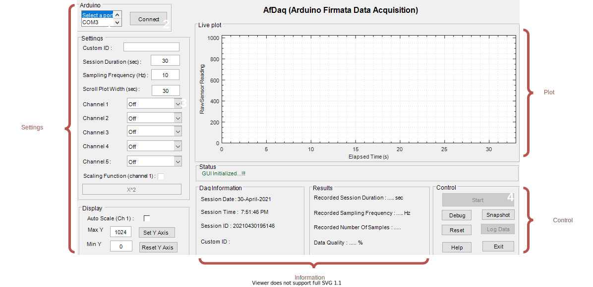

# Getting Started {#getting-started}

---

Working with AfDaq is a straightforward process. Make sure you have prerequisites available and follow the steps below.


## Prerequisites

- [MATLAB](https://in.mathworks.com/products/matlab.html)  

>`MATLAB-ver2017b` was used to develop the AfDaq. It was also tested with `ver2015b` and `ver2018b` for backward and forward compatibility respectively. It may not work with `ver20xx and before` due to the unavailability of compatible `MATLAB Support Package for Arduino Hardware`.  

- [MATLAB Support Package for Arduino Hardware](https://in.mathworks.com/hardware-support/arduino-matlab.html)  
- [Arduino](https://www.arduino.cc/) compatible hardware board.  

>For the list of the supported boards, visit documentation [here](https://in.mathworks.com/hardware-support/arduino-matlab.html#localnav:~:text=Supported%20Hardware).


## Installation and Running

1. Download the [latest stable release](https://github.com/kulbhushanchand/AfDaq/releases) and extract contents into your MATLAB working directory. Alternatively, you can also download the latest code from the [repository](https://github.com/kulbhushanchand/AfDaq).
2. Open `AfDaq.m` in MATLAB.
3. Connect Arduino board to PC with USB cable. If the board is pre-configured with Firmata code by MATLAB, a message is shown in the command window.
4. Run `AfDaq.m` and wait for the GUI to appear.
5. In the GUI select the `COM` port for the Arduino and press the `Connect` button. If the Arduino is not pre-configured with Firmata code by MATLAB, it may take few minutes (It's a one-time process in the beginning OR if the board is re-flashed outside).
6. After a successful connection, appropriate settings can be selected and acquisition is manually started.
7. The acquisition runs till a set time or can be stopped manually.
8. After successful completion, the information panel shows various statistics related to the acquisition.
9. Data can be saved for offline processing.


## GUI 

```{r gui, fig.cap= 'GUI of AfDaq. Various sub-components (Settings, Plot, Information, and Control) are labelled. Minimum interaction steps to use are numbered 1 to 4.', fig.align='center', echo=FALSE, out.width = '100%'}

```

The user interface is straightforward and easy to use. The various sub-components are arranged in panels as per their functionality. The main sub-components of the GUI and their functions are :

- Settings
  - `Arduino`: Lists the available `COM` ports. Establishes a connection to the Arduino.
  - `Settings`: Lists various settings with defaults. Up to 5 channels can be selected. 
  - `Display`: Controls the scaling of the live plot.
- Information
  - `Status`: Panel showing the current status of the GUI.
  - `Daq Information`: Panel for important information regarding the current session.
  - `Results`: Panel to display the results after the successful acquisition.
- Plot
  - `Live plot`: Panel displaying a real-time plot of the acquired data. 
- Control
  - `Control`: Panel to control the state of the GUI and data logging.

Figure \@ref(fig:gui) shows the minimum number of steps (labeled from 1 to 4) required for a simple data acquisition session. However, the number of steps may increase depending upon the user's preference. Following is a brief explanation for each of these steps.

1. Select the `COM` port from the list to which the Arduino board is connected.
2. Connect to the board.
3. Select at least one channel from the drop-down list.
4. Start the acquisition. You can pre-maturely stop the acquisition using the `Start/Stop` button at will or let it finish by itself till the session duration. 

